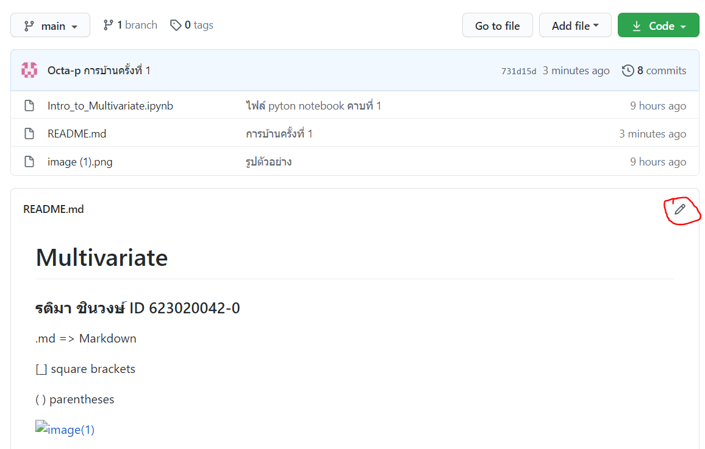
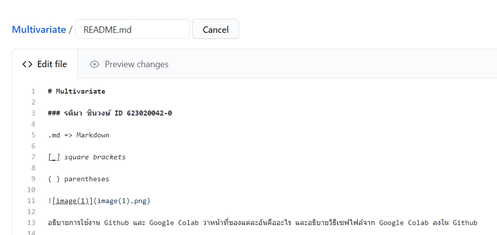

# Multivariate

### รติมา ชินวงษ์ ID 623020042-0

.md => Markdown

[_] square brackets

( ) parentheses

.png)

อธิบายการใช้งาน Github และ Google Colab ว่าหน้าที่ของแต่ละอันคืออะไร และอธิบายวิธีเซฟไฟล์จาก Google Colab ลงใน Github

### หน้าที่และการใช้งานของ Github
Github คือ เว็บไซต์ให้บริการบนออนไลน์แพลตฟอร์ม ทำให้สามารถเข้าถึงข้อมูลผ่านหน้าเว็บไซต์ได้ทุกที่ทุกเวลา

การใช้งานเบื้องต้น
ขั้นตอนแรก ให้ทำการสมัครสมาชิกกับ Github จากนั้นเมื่อสมัครสมาชิกแล้ว เราสามารถที่จะสร้าง Repository ของเราแล้วเอาไปฝากไว้บน Github ได้
ต่อจากนั้น ทำการ Create Repository

ตั้งชื่อตามที่ต้องการ และให้ติ๊กที่ Add a README file นั้นกดปุ่ม create

เมื่อกดแล้วจะได้หน้าต่างนี้ขึ้นมา เราสามารถจะเขียนโค้ดหรือแก้ไขโค้ดได้จากการกดรูปปากกาที่อยู่ดังรูปภาพ

และสามารถแก้ไขหรือเขียนโค้ดใหม่ได้ดังรูปภาพ สามารถดู Preview หลังจากเขียนโค้ดเสร็จได้ก่อนจะกด commit changes

### หน้าที่และการใช้งานของ Google Colab
Google Colab คือ Jupyter notebook ดัดแปลงที่รันอยู่บนคราวด์ และไม่จำเป็นต้องติดตั้งโปรแกรมใด ๆ ก่อนใช้งาน ซึ่งทุกคนสามารถใช้งานได้ เพียงแค่มีบัญชี Google Drive เพื่อใช้ในการจัดเก็บตัวโค้ดเท่านั้น โดยภาษา Python เป็นภาษาหลักที่ใช้ในการเขียนและรันงานบนเว็บ Colab นี้

การใช้งานเบื้องต้น
เปิดเว็บขึ้นมาจะมีหน้าแบบนี้ขึ้น

การเพิ่มช่องสำหรับใส่สคลิปให้กดปุ่ม “CODE”

หากต้องการใส่ข้อความอธิบายใน Notebook ของเรากดปุ่ม “TEXT”

หากต้องการย้ายตำแหน่งวัตถุต่าง ๆ บนหน้าจอให้เลือก Cell นั้น ๆ ก่อนแล้วค่อยกดปุ่มดังรูปนี้

### วิธีเซฟไฟล์จาก Google Colab ลงใน Github
1. กดคำว่า File ใน Google Colab แล้วเลือก Save a copy in Github

2. เปลี่ยนชื่อตามที่ต้องการ แล้วกด OK

3. หน้าเว็บจะเปลี่ยนไปที่ Github เราสามารถแก้ไขไฟล์จากใน Github ได้ หรือจะกลับไปแก้ใน Google Colab ก็ได้ โดยการกด open in Colab

